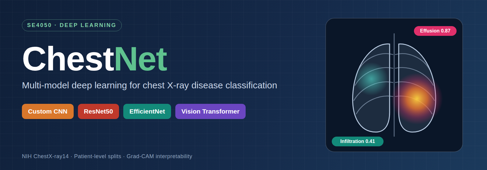
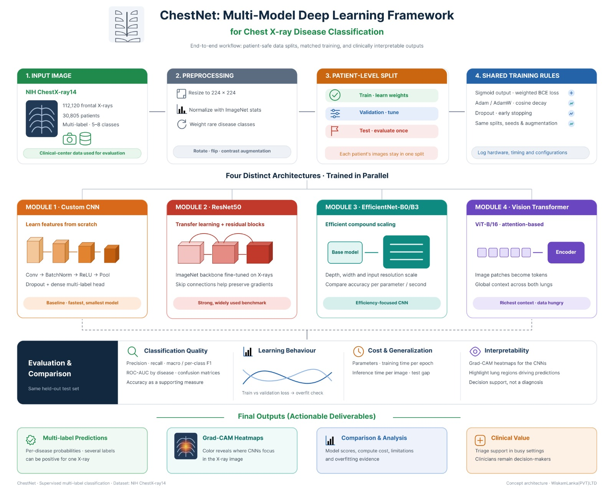

<p align="center">
  
</p>

# 🫁 ChestNet

**Multi-Model Deep Learning Framework for Chest X-ray Multi-Disease Classification**


**Current status:** 🚧 PIPELINE READY. Code for all four models, the shared configs and the random seeds is in place. Training runs and results are in progress.

ChestNet trains and critically compares **four architecturally distinct deep learning models** on chest X-ray images under the same data splits, augmentation and evaluation protocol. Each model predicts the presence of one or more thoracic diseases (for example Effusion, Infiltration, Atelectasis, Cardiomegaly, Nodule, Mass, Pneumonia or No Finding). Grad-CAM heatmaps show *where* the CNNs look when they make a prediction.

> ⚠️ **Disclaimer:** this is an academic research project (SE4050 – Deep Learning). It is a decision-support concept and **not** a medical diagnostic tool.

---

## 🧭 System overview

<p align="center">
  
</p>

---

## 🧠 The four models

| # | Model | Role | Key idea |
|---|-------|------|----------|
| 1 | 🟧 **Custom CNN** (from scratch) | Baseline | Conv → BatchNorm → ReLU → MaxPool blocks, dropout and a dense multi-label head. No pretrained weights, so it shows the value of transfer learning. |
| 2 | 🟥 **ResNet50** (transfer learning) | Deep residual benchmark | ImageNet-pretrained and fine-tuned. Skip connections keep gradients flowing through deep networks. |
| 3 | 🟩 **EfficientNet-B0/B3** | Efficiency-focused CNN | Compound scaling of depth, width and resolution. Compared on accuracy per parameter and per second. |
| 4 | 🟪 **Vision Transformer (ViT-B/16)** | Attention-based | Image patches become tokens, and self-attention captures global context across both lungs. Uses ImageNet weights from `keras-hub`; a smaller from-scratch ViT is available with `pretrained: false`. |

---

## 🛠️ Technology

- **Language:** Python 3.10+
- **Deep learning:** TensorFlow 2.16+ with Keras 3 (`keras.applications` for ResNet50 and EfficientNet, `keras-hub` for the pretrained ViT-B/16)
- **Input pipeline:** `tf.data` with Keras augmentation layers
- **Data and metrics:** NumPy, pandas, scikit-learn
- **Visualisation:** Matplotlib, Seaborn, Grad-CAM (implemented with `tf.GradientTape`)
- **Configuration:** YAML files in `configs/` with a fixed random seed
- **Workflow:** Jupyter notebooks for EDA, `src/` for reusable, runnable code

---

## 📁 Project structure

```text
ChestNet/
├── configs/
│   ├── base.yaml            # Shared settings for ALL models (seed, classes, splits, training)
│   ├── custom_cnn.yaml      # Model-specific overrides
│   ├── resnet50.yaml
│   ├── efficientnet.yaml
│   └── vit.yaml
├── data/
│   ├── README.md            # How to download and place the dataset
│   ├── raw/                 # NIH images (git-ignored)
│   └── splits/              # Saved patient-level train/val/test CSVs
├── docs/assets/             # Banner and system diagram
├── notebooks/               # EDA and exploration
├── results/                 # Metrics, curves, ROC plots, confusion matrices, Grad-CAM
├── saved_models/            # Best weights per model (git-ignored)
├── src/
│   ├── config.py            # Merges base.yaml with a model config
│   ├── train.py             # Train one model
│   ├── evaluate.py          # Test-set metrics and comparison table
│   ├── explain.py           # Grad-CAM heatmaps
│   ├── models/              # custom_cnn.py, resnet50.py, efficientnet.py, vit.py
│   ├── preprocessing/       # splits.py (patient-level split), dataset.py (tf.data pipeline)
│   └── utils/               # seed.py, losses.py, metrics.py, plots.py, gradcam.py
├── requirements.txt
├── LICENSE
└── README.md
```

---

## 🚀 Local setup

**1. Clone the repository**

```bash
git clone https://github.com/Deep-Learning-Models/ChestNet.git
cd ChestNet
```

**2. Create and activate a virtual environment**

Windows:

```bash
python -m venv .venv
.venv\Scripts\activate
```

macOS or Linux:

```bash
python3 -m venv .venv
source .venv/bin/activate
```

**3. Install dependencies**

```bash
pip install -r requirements.txt
```

> 💡 **GPU:** on Linux or WSL2, install `tensorflow[and-cuda]` instead of `tensorflow` to train on an NVIDIA GPU. Native Windows runs TensorFlow on the CPU only, so use **WSL2** or **Google Colab** for GPU training.

---

## ▶️ How to run

Run every command from the repository root.

**1. Create the patient-level splits (once, shared by all models)**

```bash
python -m src.preprocessing.splits
```

This writes `data/splits/train.csv`, `val.csv`, `test.csv` and `summary.csv` (class counts per split).

**2. Train a model**

```bash
python -m src.train --config configs/custom_cnn.yaml
python -m src.train --config configs/resnet50.yaml
python -m src.train --config configs/efficientnet.yaml
python -m src.train --config configs/vit.yaml
```

Add `--epochs 2` for a quick test run, or `--deterministic` for fully repeatable GPU results.

**3. Evaluate on the test set (once per model, at the very end)**

```bash
python -m src.evaluate --config configs/resnet50.yaml
```

**4. Grad-CAM heatmaps (CNN models)**

```bash
python -m src.explain --config configs/resnet50.yaml --num-images 8
```

**Where the outputs go**

| File | Created by | Contents |
|------|-----------|----------|
| `saved_models/<model>_best.weights.h5` | train | Best weights (highest validation AUC) |
| `results/<model>/config_used.yaml` | train | Exact settings used for the run |
| `results/<model>/history.csv`, `training_curves.png` | train | Loss and AUC per epoch |
| `results/<model>/training_summary.json` | train | Parameters, time per epoch, hardware, best epoch |
| `results/<model>/test_metrics.json`, `test_per_class_metrics.csv` | evaluate | Precision, recall, F1, ROC-AUC |
| `results/<model>/test_roc_curves.png`, `test_confusion_matrices.png` | evaluate | Plots for the report |
| `results/comparison.csv` | evaluate | One row per model, for the comparison table |
| `results/<model>/gradcam.png` | explain | Heatmaps over test X-rays |

---

## 📊 Dataset

| Item | Detail |
|------|--------|
| **Source** | [NIH ChestX-ray14](https://www.kaggle.com/datasets/nih-chest-xrays/data), NIH Clinical Center |
| **Size** | 112,120 frontal chest X-rays from 30,805 patients |
| **Labels** | 14 disease labels (multi-label) plus *No Finding* |
| **Our scope** | 5–8 disease classes plus *No Finding*, with a balanced subset of about 1,000–2,000 images per class |

**How to get the data**

1. Download the dataset from the link above.
2. Put the image folders in `data/raw/` and the label file (`Data_Entry_2017.csv`) in `data/`.
3. `data/raw/` is listed in `.gitignore`, so images are **never** pushed to GitHub.

Full step-by-step instructions are in [`data/README.md`](data/README.md).

---

## ⚙️ Shared experimental protocol

Every model follows the same rules so the comparison is fair.

- 🖼️ **Preprocessing:** resize to 224 × 224 and normalise with ImageNet mean and standard deviation.
- 🔄 **Augmentation:** small rotations, horizontal flips, and brightness/contrast jitter. Only clinically plausible changes are used.
- 🧍 **Patient-level split:** each patient's images stay in **one** split (train / validation / test), which prevents data leakage.
- ⚖️ **Class imbalance:** weighted binary cross-entropy loss.
- 🧪 **Training:** sigmoid outputs, Adam/AdamW, cosine learning-rate decay, dropout and early stopping.
- 🎲 **Reproducibility:** `seed: 42` in `configs/base.yaml` fixes Python, NumPy and TensorFlow randomness (`src/utils/seed.py`). Every run saves its exact config, hardware and training time to `results/<model>/`.
- 🔒 **The test set is evaluated once**, at the very end.

---

## 📈 Evaluation

| Category | What we measure |
|----------|-----------------|
| 🎯 Classification quality | Precision, recall, F1 (macro and per class), ROC-AUC per disease, confusion matrices, accuracy (context only) |
| 📉 Learning behaviour | Training vs validation loss and accuracy curves (overfitting check) |
| ⏱️ Cost and generalisation | Parameter count, training time per epoch, inference time per image, validation-to-test gap |
| 🔍 Interpretability | Grad-CAM heatmaps for the CNN-based models |

### 🏆 Results

> Results will be added as each model is trained.

| Model | Macro F1 | Macro ROC-AUC | Params | Train time / epoch | Inference / image |
|-------|:--------:|:-------------:|:------:|:------------------:|:-----------------:|
| Custom CNN | – | – | – | – | – |
| ResNet50 | – | – | – | – | – |
| EfficientNet | – | – | – | – | – |
| ViT-B/16 | – | – | – | – | – |

---

## 👥 Team

| Member | Primary ownership |
|--------|-------------------|
| Member 1 | Dataset, EDA, preprocessing pipeline, Custom CNN |
| Member 2 | ResNet50 transfer-learning pipeline |
| Member 3 | EfficientNet and Grad-CAM interpretability |
| Member 4 | Vision Transformer and results comparison dashboard |

---

## 🌿 Contribution workflow

1. Create a feature branch from `main`, for example `feature/resnet50`.
2. Commit small, meaningful changes with clear messages.
3. Push and open a **pull request** into `main`.
4. Another team member reviews it before it is merged.

Every member commits and pushes **at least once a week**.

---

## 📄 License

Released under the [MIT License](LICENSE).
